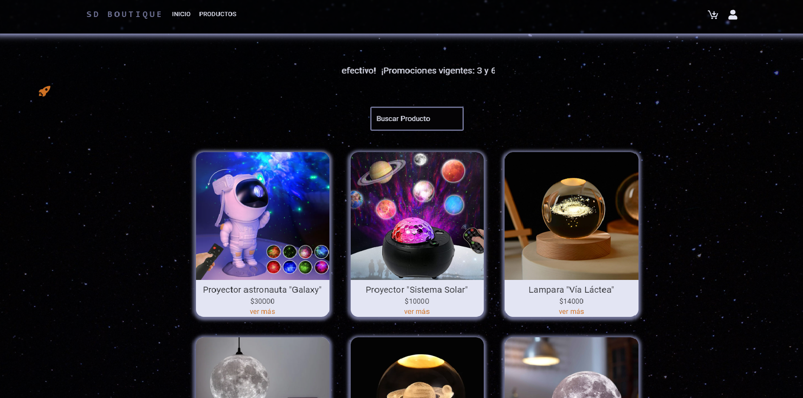
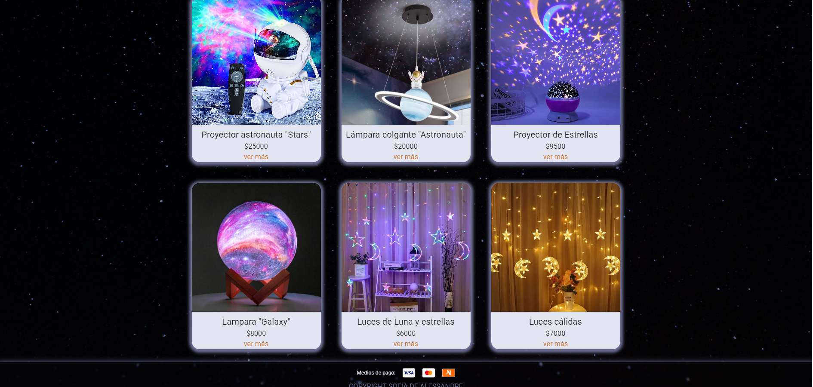

# SD Boutique

Project e-commerce for the Frontend Development Bootcamp in ADA ITW

Deployment: https://tienda-adae-commerce.web.app/

Description: "SD Boutique" is an e-commerce of lamps. This allows you to view all products in detail, filter them, add them to cart and make a purchase. This virtual store uses dinamic rutes, Firebase and responsive design. 

Technologies: React, Material UI, Firebase

Author: Sofía De Alessandre

August 2024

